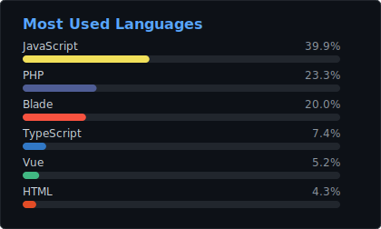

#  Hey! Nice to see you.

 Hi, I'm Ahsan Habib, a backend-focused, dependable full-stack software developer with experience building web applications, APIs, AI-enabled automation, microservice-based systems and integration-heavy products. I build scalable web systems that connect products, APIs, AI and automation. Over three years I've delivered enterprise projects with clean code and efficient use of modern web technologies, helping convert a vision and an idea into meaningful, useful products. These days I focus on backend and real-time systems, AI/LLM integration and web-scraping, working as a Top Rated freelancer on Upwork with 100% Job Success. I am from Thakurgaon, Bangladesh, currently living in Joensuu, Finland.!!
 
 

### Talking about Personal Stuffs:

- 👨🏽‍💻 Proven expertise in advanced web technologies, especially in Python, Django, PHP, Laravel, Node.js, Phoenix, Javascript, Typescript, ReactJs & NextJs.
- ⚡ Currently building real-time multiplayer systems (WebSocket + LiveKit SFU) and AI/LLM-powered backend integrations.
- 💬 Ask me about Anything, I'll be happy to answer.
- 😄 Fun fact: I love to watch popular and recent movies and series.
- ✍ You can find my projects here **[Portfolio → ahsanlab.me](https://ahsanlab.me)**

## 📫 Let's Connect!

Feel free to reach out to me for collaboration or just a friendly chat about tech and innovations!

   

---

 

## 🛠️ Things I Code With

**Programming Languages:**

---

**Frameworks & Technologies:**

---

**Tools & Services:**

---

---

 

## 🚀 Career Objective

My goal is to be a Technical Architect by utilizing my technical expertise and communication skills to design and implement effective tech solutions that drive business value by applying cutting-edge technologies and best practices. I aim to make a positive impact on the organization and contribute to its success.

---

## 🛠️ Skills

### Strong Knowledge:

- **Backend Systems**: Python, Django, Django-Rest-Framework, Node.js, Express, Phoenix, Laravel, REST, GraphQL, FastAPI
- **Architecture & Real-time**: Microservices, API Gateway, WebSocket, LiveKit SFU, Redis, Kafka, scalable system design
- **AI / LLM**: OpenAI API, RAG, NLP workflows, AI-enabled automation

### Industry Experience:

- **Frameworks & Technologies**: Python, Django, Django-Rest-Framework, PHP, Laravel, Node.js, Express, Phoenix, React, Redux, Nextjs, REST, GraphQL, FastAPI, PostgreSQL, MySQL, Redis, Kafka, WebSocket, LiveKit SFU, OpenAI API / RAG, JavaScript, Tailwind CSS, Bootstrap, HTML, CSS, Microservice Architecture, API Gateway, SOLID & DRY, SMS & Payment Gateway, OAuth 2.0

### DevOps & Platforms:

- **Tools & Services**: Azure (certified), VPS, Dedicated servers, Git, Docker, Kubernetes, GitHub Action, Azure DevOps, DigitalOcean, Heroku, CyberPanel, Cpanel, Jenkins, MinIO

---

## 🎓 Education

**B. Sc. in Information and Communication Technology**

- **Duration**: 2016 – 2020
- **CGPA**: 3.27 out of 4
- **Institution**: Islamic University, Bangladesh

---

## 💼 Work Experience

**Software Developer (Freelance) - Upwork**

- **2024 – Present**
- Top Rated freelancer with 100% Job Success delivering backend, full-stack, AI/LLM integration and web-scraping projects.

**Backend / Real-time Systems - Matrix Bingo**

- **Current**
- Developing the backend game engine, WebSocket events and [LiveKit](https://livekit.io) SFU video-calling setup for a scale-oriented real-time multiplayer bingo platform ([matrixbingo.com](https://matrixbingo.com)).

**Backend Developer - Tovari Oy, Joensuu, Finland**

- **2025**
- Integrated Express.js backend services with Screaming Frog SEO Spider and the OpenAI API while working within Finnish engineering culture (short-term, part of the govt. training program).

**Software Engineer (Full Time) - Interlink TechSoft Limited**

- **November 2022 – December 2023**
- Contributed to Python, Django and Express.js microservices for a public library management system serving 60+ district branches, plus modules for a government archive platform.
- Contributed to several modules of the Library Research and Archive Management System of the Parliament of Bangladesh Government, improving efficiency and user experience.
- Collaborated with UI/UX teams for successful project outcomes for the SUST and PUST library websites.
- Designed and developed the Public Library Management System with Microservice Architecture, ensuring a robust and scalable system.
- Integrated frontend and backend components, managing resources to achieve project goals.

**Web Developer (Full Time) - KS Friends Chemical Ltd**

- **February 2022 – October 2022**
- Designed and developed the [KS Friends Chemical website](https://ksfchemicals.com) using Django, JavaScript, and Tailwind CSS.
- Managed daily operational activities and planning, demonstrating strong team management skills.
- Collaborated with other teams to ensure successful project outcomes.

**Junior Software Developer (Freelance) - Global Marketplace Online Ltd**

- **June 2021 – January 2022**
- Developed the Global Marketplace Online website, a multi-vendor e-commerce platform using a microservice approach.
- Deployed web solutions using different tools and scripts, managing CI/CD and testing with Azure DevOps.

**Bangladesh Nurses Association (Freelance)**

- **January 2021 – April 2021**
- Designed and developed the [BNA website](https://bna.com.bd) using Django, JavaScript, and Tailwind CSS.
- Implemented member management functionality to better serve the association's members.

---

## 🌟 Interpersonal Traits

Innovative, Supportive, Reliable, Analytical, Flexible, Tech-savvy, Active listener

---

## 🌐 Languages

- **Bangla**: Native
- **English**: Professional Proficiency

---

## 📜 Training & Certifications

- **Full Stack Web Development Courses** - Codewithmosh.com
- **Introduction to Containers w/ Docker, Kubernetes & OpenShift** (Certified)
- **Application Development using Microservices and Serverless** (Certified)
- **Linux for Developers** - The Linux Foundation, Coursera (Certified)
- **Speak English Professionally: In Person, Online & On the Phone** - Georgia Institute of Technology, Coursera (Certified)
- **Microsoft Certified: Azure Fundamentals** - Microsoft (Certified)
- **Microsoft Certified: Azure Administrator Associate** - Microsoft (Certified)
- **Microsoft Certified: Azure AI Engineer Associate** - Microsoft (Certified)

---

## 📞 References

**Mithun Modak**

- **Director, Interlink TechSoft Limited**
- **Email**: mithun@intertechbd.com
- **Mobile**: +880 1550-063216
- **Phone**: +880 2223364175

**Abu Zabar Rezvhe**

- **BDM-Bangladesh operation, Atlas Axillia Co. (Pvt) Ltd.**
- **Entrepreneur, KS Friends Chemical Ltd.**
- **Phone**: +880 1711-504223
- **Email**: rezvhe@gmail.com

---

## 🚀 Featured Projects

<table>
  <tr>
    <td width="50%" align="center">
      
       <b><a href="https://matrixbingo.com/">Matrix Bingo</a></b>
      
Real-time multiplayer game platform — backend game engine, WebSocket events and LiveKit SFU video calling.

    </td>
    <td width="50%" align="center">
      
       <b>Tovari AI Integration</b>
      
Express.js backend connecting Screaming Frog SEO tooling with OpenAI-powered workflow automation.

    </td>
  </tr>
  <tr>
    <td width="50%" align="center">
      
       <b><a href="https://ksfchemicals.com/">KS Friends Chemicals</a></b>
      
Production Django web platform for ksfchemicals.com.

    </td>
    <td width="50%" align="center">
      
       <b><a href="https://farmioglobal.com/">Farmio Global</a></b>
      
Public product system connecting rural Bangladesh producers with international buyers.

    </td>
  </tr>
  <tr>
    <td width="50%" align="center">
      
       <b><a href="https://www.upwork.com/freelancers/ahsan01">Upwork — Top Rated</a></b>
      
Backend, full-stack, AI/LLM integration and web-scraping work with 100% Job Success.

    </td>
    <td width="50%" align="center" valign="middle">
      <b>More on my portfolio</b>
      
<a href="https://ahsanlab.me">→ ahsanlab.me</a>

    </td>
  </tr>
</table>

 
 
 ---
 
 

### Most Used Languages

  

### My GitHub Stats

    
Statistic

 
 

 

