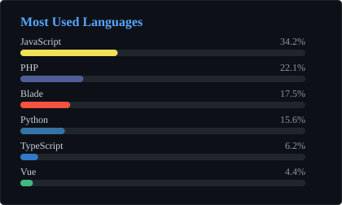
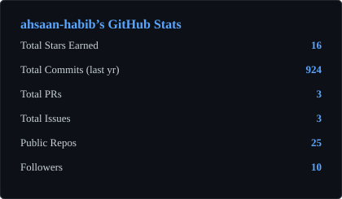

#  Hey! Nice to see you.

 Hi, I'm Ahsan Habib, a **Software Engineer | Backend Systems & Applied AI**. Since 2022 I've been building backend services, full-stack products and AI-enabled workflows: public-sector microservices, API integrations, freelance product delivery and real-time multiplayer systems. My applied AI work covers RAG, tool-calling agents, evaluation pipelines, LLM observability, local inference and streaming voice, documented as case studies at [tech.ahsanlab.me](https://tech.ahsanlab.me). I'm a Top Rated freelancer on Upwork with 100% Job Success, including a delivered AI-agent workflow with tool integration. I am from Thakurgaon, Bangladesh, currently living in Joensuu, Finland, and authorized for full-time work in Finland and the EU.
 
 

### Talking about Personal Stuffs:

- 👨🏽‍💻 Proven expertise in advanced web technologies, especially in Python, Django, PHP, Laravel, Node.js, Phoenix, Javascript, Typescript, ReactJs & NextJs.
- ⚡ Currently building real-time multiplayer systems (WebSocket + LiveKit SFU) and AI/LLM-powered backend integrations.
- 🎉 Recently launched [MomentStage](https://momentstage.com), an animated greeting and invitation platform I branded, designed and built end to end.
- 🤖 Applied AI: hybrid-retrieval RAG with citation/refusal gates, bounded tool-calling agents, Ragas eval sets with CI gates, and Langfuse tracing for tokens, cost and latency.
- 💬 Ask me about Anything, I'll be happy to answer.
- 😄 Fun fact: I love to watch popular and recent movies and series.
- ✍ You can find my projects here **[Portfolio → ahsanlab.me](https://ahsanlab.me)**
- 🧪 AI engineering case studies: **[tech.ahsanlab.me](https://tech.ahsanlab.me)**

---

 

## 🛠️ Things I Code With

**Programming Languages:**

---

**Frameworks & Technologies:**

---

**Tools & Services:**

---

---

 

## 🚀 Career Objective

My goal is to be a Technical Architect by utilizing my technical expertise and communication skills to design and implement effective tech solutions that drive business value by applying cutting-edge technologies and best practices. I aim to make a positive impact on the organization and contribute to its success.

---

## 🛠️ Skills

### Strong Knowledge:

- **Backend Systems**: Python, Django, Django-Rest-Framework, Node.js, Express, Phoenix, Laravel, REST, GraphQL, FastAPI
- **Architecture & Real-time**: Microservices, API Gateway, WebSocket, LiveKit SFU, Redis, Kafka, scalable system design
- **Applied AI / LLM**: OpenAI API, RAG (embeddings, Chroma, BM25, reciprocal rank fusion, cross-encoder reranking, citation/refusal handling), LLM tool calling and agent loops, structured outputs (Pydantic), Ragas evaluation and CI regression gates, Langfuse tracing, Ollama / local inference, streaming ASR/TTS

### Industry Experience:

- **Frameworks & Technologies**: Python, Django, Django-Rest-Framework, PHP, Laravel, Node.js, Express, Phoenix, React, Redux, Nextjs, REST, GraphQL, FastAPI, PostgreSQL, MySQL, Redis, Kafka, WebSocket, LiveKit SFU, OpenAI API / RAG, Ragas, Langfuse, Ollama, JavaScript, Tailwind CSS, Bootstrap, HTML, CSS, Microservice Architecture, API Gateway, SOLID & DRY, SMS & Payment Gateway, OAuth 2.0

### DevOps & Platforms:

- **Tools & Services**: Azure (certified), VPS, Dedicated servers, Git, Docker, Kubernetes, GitHub Action, Azure DevOps, DigitalOcean, Heroku, CyberPanel, Cpanel, Jenkins, MinIO

---

## 🎓 Education

**Finnish Integration Training and Preparatory Studies for Higher Education (30 ECTS)**

- **Duration**: 2024 – 2026
- **Institution**: Xamk, South-Eastern Finland University of Applied Sciences
- Finnish B2 course passed with grade 4/5.

**B. Sc. in Information and Communication Technology**

- **Duration**: 2016 – 2020
- **CGPA**: 3.27 out of 4
- **Institution**: Islamic University, Bangladesh

---

## 💼 Work Experience

**Software Developer (Freelance) - Upwork**

- **2024 – Present**
- Top Rated freelancer with 100% Job Success delivering backend, full-stack, AI/LLM integration and web-scraping projects.
- Delivered a core AI-agent workflow with tool integration for a freelance client; contract completed with a 5.0 rating.

**Independent AI Engineering - AhsanLab Tech**

- **2025 – Present**
- Build RAG, evaluation, observability, streaming voice and tool-calling agent projects, published as case studies at [tech.ahsanlab.me](https://tech.ahsanlab.me).

**Backend / Real-time Systems - Matrix Bingo**

- **Current**
- Developing the backend game engine, WebSocket events and [LiveKit](https://livekit.io) SFU video-calling setup for a scale-oriented real-time multiplayer bingo platform ([matrixbingo.com](https://matrixbingo.com)).

**Backend Developer - Tovari Oy, Joensuu, Finland**

- **2025**
- Integrated Express.js backend services with Screaming Frog SEO Spider and the OpenAI API while working within Finnish engineering culture (short-term, part of the govt. training program).

**Software Engineer (Full Time) - Interlink TechSoft Limited**

- **November 2022 – December 2023**
- Contributed to Python, Django and Express.js microservices for a public library management system serving 60+ district branches, plus modules for a government archive platform.
- Contributed to several modules of the Library Research and Archive Management System of the Parliament of Bangladesh Government, improving efficiency and user experience.
- Collaborated with UI/UX teams for successful project outcomes for the SUST and PUST library websites.
- Designed and developed the Public Library Management System with Microservice Architecture, ensuring a robust and scalable system.
- Integrated frontend and backend components, managing resources to achieve project goals.

**Web Developer (Full Time) - KS Friends Chemical Ltd**

- **February 2022 – October 2022**
- Designed and developed the [KS Friends Chemical website](https://ksfchemicals.com) using Django, JavaScript, and Tailwind CSS.
- Managed daily operational activities and planning, demonstrating strong team management skills.
- Collaborated with other teams to ensure successful project outcomes.

**Junior Software Developer (Freelance) - Global Marketplace Online Ltd**

- **June 2021 – January 2022**
- Developed the Global Marketplace Online website, a multi-vendor e-commerce platform using a microservice approach.
- Deployed web solutions using different tools and scripts, managing CI/CD and testing with Azure DevOps.

**Bangladesh Nurses Association (Freelance)**

- **January 2021 – April 2021**
- Designed and developed the [BNA website](https://bna.com.bd) using Django, JavaScript, and Tailwind CSS.
- Implemented member management functionality to better serve the association's members.

---

## 🤖 Applied AI Lab

One client delivery, plus independent engineering projects documented as case studies at [tech.ahsanlab.me](https://tech.ahsanlab.me).

| Project | What it is | Case study |
|---|---|---|
| **AI Agent Workflow** (Upwork client, ★ 5.0) | Delivered a core AI-agent workflow with tool integration for a freelance client. | [Upwork profile](https://www.upwork.com/freelancers/ahsan01) |
| **Documentation RAG** | Documentation assistant combining BM25/vector hybrid retrieval, reciprocal rank fusion, cross-encoder reranking, and a citation/refusal gate. | [Read](https://tech.ahsanlab.me/posts/i-built-four-ai-engineering-projects-in-12-weeks-here-is-every-number) |
| **Evals & Observability** | Hand-verified eval set and CI checks for retrieval quality, grounded answers and correct refusals (Ragas), traced with self-hosted Langfuse (retrieval, prompts, tokens/cost, latency percentiles). | [Evals](https://tech.ahsanlab.me/posts/how-do-you-know-your-ai-got-worse-build-the-eval-set-first) · [Tracing](https://tech.ahsanlab.me/posts/your-ai-system-is-failing-right-now-and-nothing-is-alerting) |
| **Streaming Voice Agent** | ASR → retrieval → streaming LLM → TTS over WebSockets, with sentence-level speech output and explicit timeout/fallback paths. | [Read](https://tech.ahsanlab.me/posts/the-940ms-voice-agent-where-every-millisecond-goes) |
| **Bounded Tool-Calling Agent** | Tool-schema design, step/cost limits, repetition detection, context compaction, explicit termination. | [Read](https://tech.ahsanlab.me/posts/inside-the-agent-loop-how-an-ai-agent-actually-decides-what-to-do) |
| **Local LLM Benchmark** | Compared small local models (Llama 3.2 3B, Phi-4-mini, Mistral 7B) via Ollama + FastAPI for latency, memory, throughput and schema-valid structured output. | [Read](https://tech.ahsanlab.me/posts/can-a-3b-model-do-the-job-benchmarking-local-llms-on-one-laptop) |

---

## ⭐ Client Feedback

Public Upwork reviews (5.0 rating each), trimmed with "…":

> "I gave Ahsan full control of the system and trusted him to handle the project independently. After just a few days, he came back with the entire project successfully completed. … Ahsan did an excellent job building and integrating our AI and LLM-based system, understood the technical requirements quickly, and delivered a reliable solution. … I would gladly work with him again and highly recommend him for AI, LLM, and full-stack development projects."
>
> — Upwork client · *AI-Native Full-Stack Web Developer | AI & LLM Integration* · Aug 12 – Oct 5, 2026

> "Ahsan has been an absolutely dependable and invaluable developer for our project. He has been genuinely life-saving at critical moments and consistently finds practical solutions whenever we face a technical challenge. … he takes the time to understand the entire business, the technical architecture, and what we are ultimately trying to achieve. … Because of the quality of his work and how well he now understands our business, I am already assigning him a new AI Engineer role to continue working with us on the next stage of the project."
>
> — Upwork client · *Website Upgrade .php* · Mar 1, 2025 – Aug 12, 2026

---

## 🌟 Interpersonal Traits

Innovative, Supportive, Reliable, Analytical, Flexible, Tech-savvy, Active listener

---

## 🌐 Languages

- **Bangla**: Native
- **English**: Professional Proficiency
- **Finnish**: Intermediate (B1+)

---

## 📜 Training & Certifications

- **Full Stack Web Development Courses** - Codewithmosh.com
- **Introduction to Containers w/ Docker, Kubernetes & OpenShift** (Certified)
- **Application Development using Microservices and Serverless** (Certified)
- **Linux for Developers** - The Linux Foundation, Coursera (Certified)
- **Speak English Professionally: In Person, Online & On the Phone** - Georgia Institute of Technology, Coursera (Certified)
- **Microsoft Certified: Azure Fundamentals** - Microsoft (Certified)
- **Microsoft Certified: Azure Administrator Associate** - Microsoft (Certified)
- **Microsoft Certified: Azure AI Engineer Associate** - Microsoft (Certified)

---

## 🚀 Featured Projects

<table>
  <tr>
    <td width="50%" align="center">
      
       <b><a href="https://matrixbingo.com/">Matrix Bingo</a></b>
      
Real-time multiplayer game platform — backend game engine, WebSocket events and LiveKit SFU video calling.

    </td>
    <td width="50%" align="center">
      
       <b><a href="https://momentstage.com/">MomentStage</a></b>
      
Animated, shareable greeting cards and invitations: 47 themes, 7 languages, light and dark modes, music, RSVPs and share-ready images with QR codes. Designed, branded and developed end to end.

    </td>
  </tr>
  <tr>
    <td width="50%" align="center">
      
       <b>Tovari AI Integration</b>
      
Express.js backend connecting Screaming Frog SEO tooling with OpenAI-powered workflow automation.

    </td>
    <td width="50%" align="center">
      
       <b><a href="https://ksfchemicals.com/">KS Friends Chemicals</a></b>
      
Production Django web platform for ksfchemicals.com.

    </td>
  </tr>
  <tr>
    <td width="50%" align="center">
      
       <b><a href="https://farmioglobal.com/">Farmio Global</a></b>
      
Public product system connecting rural Bangladesh producers with international buyers.

    </td>
    <td width="50%" align="center">
      
       <b><a href="https://www.upwork.com/freelancers/ahsan01">Upwork — Top Rated</a></b>
      
Backend, full-stack, AI/LLM integration and web-scraping work with 100% Job Success.

    </td>
  </tr>
  <tr>
    <td colspan="2" align="center" valign="middle">
      <b>More on my portfolio</b>
      
<a href="https://ahsanlab.me">→ ahsanlab.me</a> · <a href="https://tech.ahsanlab.me">→ tech.ahsanlab.me</a> (AI case studies)

    </td>
  </tr>
</table>

 
 
 ---
 
 

### Most Used Languages

  

### My GitHub Stats

